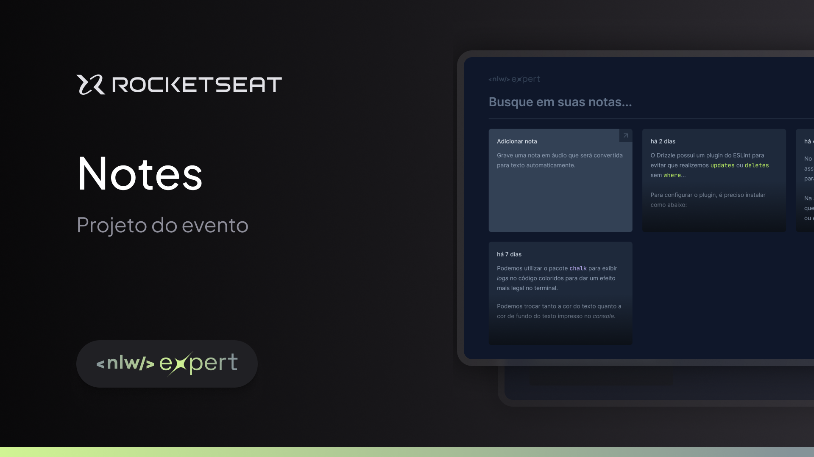

<h1 align="center"> Expert Notes </h1>

<p align="center">
Essa aplicação foi desenvolvida durante o NLW Expert da Rocketseat. <br/>
</p>

<p align="center">
  
</p>

<p align="center">
  
</p>

 <h3 align="center"><a href="https://notes-react-self.vercel.app/" target="_blank">Projeto ao vivo</a></h3>

### 🚀 Tecnologias

Esse projeto foi desenvolvido com as seguintes tecnologias:

- React
- TypeScript
- Tailwind
- Vite
- SpeechRecognition API

### 💻 Executando

Após clonar o repositório, acesse a pasta do projeto e execute os comandos abaixo:

```sh
npm install
npm run dev
```

Acesse http://localhost:5173 para visualizar a aplicação.

### :memo: Licença

Esse projeto está sob a licença MIT.

---

Feito com ♥ by Isadora Aguiar :wave:
